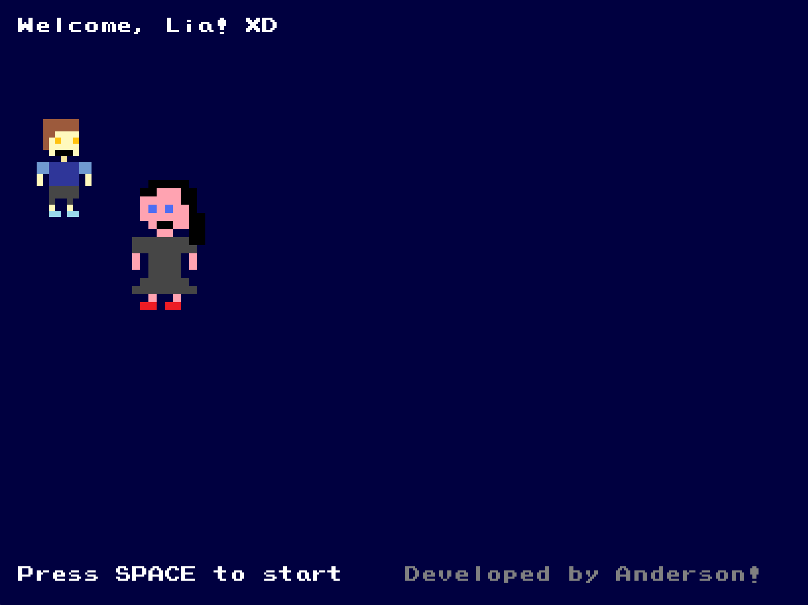
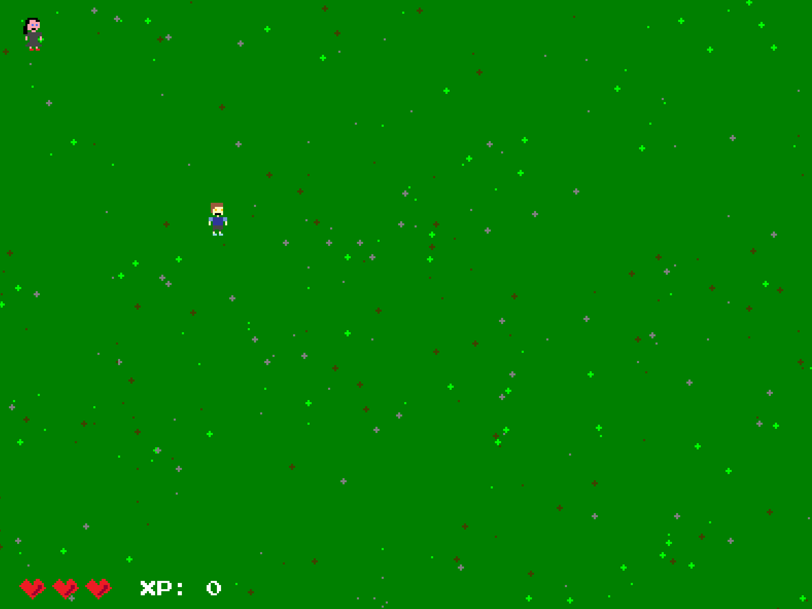
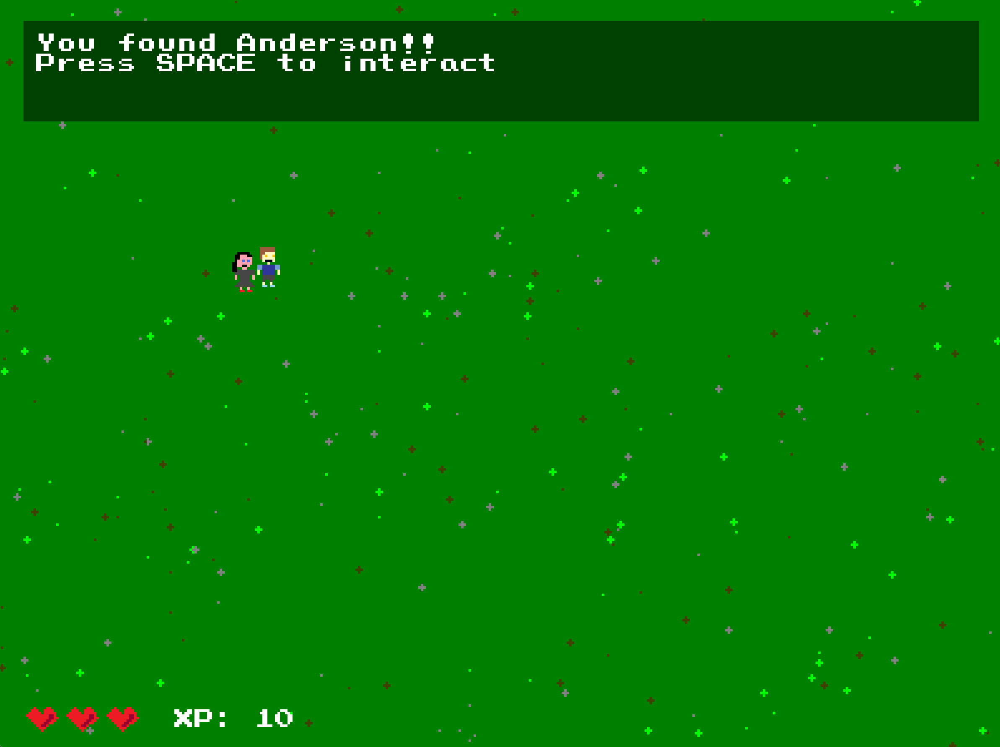
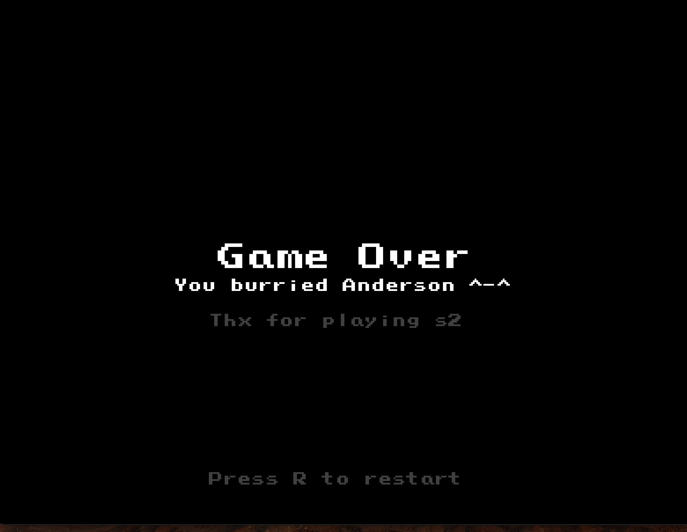

# Compiled and tested only on Mac OS

Small game for killing me.

I developed this to show to a friend, "Lia" - she's kinda cute. Idk why I'm writing this here.

## How to run

```bash
brew install libpng
make
```

## Running on other platforms

I don't know, but you can try. I think you'd just need to remove the OpenGL stuff on the `Makefile`. Since that is mac specific. Other than that it should work fine. LMK if you try it.

## Screenshots






